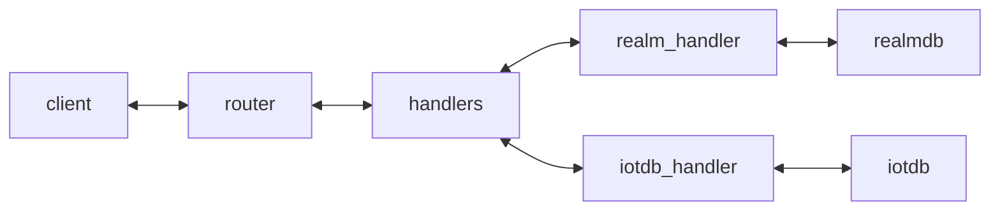

# Information Layer

The information layer is responsible for providing a raw data access [API](#api) (read, write, subscribe).
Its intention is to abstract the underlying data storage database technology.

Clients can interact with it using websockets and JSON payload.


The information-layer consists of two logical components:
- database handler: Interaction with the chosen database, configurable
- router: API provider that connects to the database handler



# Hello World Setup

## Backend Option 1: IoTDB

### Start the database

Start the db:
```bash
docker run -d --rm --name iotdb -p 6667:6667 -p 9003:9003 apache/iotdb:latest
```
Connect to it via cli:
```bash
docker exec -it iotdb ./start-cli.sh -h 127.0.0.1 -p 6667 -u root -pw root
```
Create a database
```bash
create database root.Vehicles
```
Create desired timeseries

```bash
create timeseries root.Vehicles.Vehicle_TraveledDistance WITH DATATYPE=FLOAT, ENCODING=RLE
create timeseries root.Vehicles.Vehicle_Speed WITH DATATYPE=FLOAT, ENCODING=RLE
```

### Start router

Build the router image
```bash
docker build -t router .
```
Run the router
```bash
# Docker
docker run --rm --name router -p 8080:8080 -e HANDLER_TYPE=iotdb -e IOTDB_HOST=host.docker.internal router
# OR natively
npm install
HANDLER_TYPE=iotdb IOTDB_HOST=localhost npm start
```

## Backend Option 2: RealmDB


### Prepare cloud

- Ensure that in your [ATLAS cloud](https://cloud.mongodb.com/) app there is a vehicle _document_ with an `Vehicle_VehicleIdentification_VIN` in a collection named _`Vehicles`_.
- Ensure that this document as well contains VSS data. Here you can see the data supported in this repository for a vehicle document within _Vehicles_ that should be reflected in ATLAS:

```
_id: "<SOME_STRING>" (String)
Vehicle_Speed: <SOME_DOUBLE> (Double)
Vehicle_TraveledDistance: "<SOME_DOUBLE>" (Double)
```

### Start router

Build the router image
```bash
docker build -t router .
```
Run the router
```bash
# Docker
docker run --rm --name router -p 8080:8080 -e HANDLER_TYPE=realmdb -e VERSION_REALMDB_SCHEMA=0 -e REALM_APP_ID=<YOUR-APP-ID> -e REALM_API_KEY=<YOUR-API-KEY> router
# OR natively
npm install
HANDLER_TYPE=realmdb VERSION_REALMDB_SCHEMA=0 REALM_APP_ID=<YOUR-APP-ID> REALM_API_KEY=<YOUR-API-KEY> npm start
```

## Usage

See [api](#api) how to interact with the router.

# API

Connect your own websocket client by connecting to `ws://localhost:8080`.

The examples use [websocat](https://github.com/vi/websocat) and [jq](https://github.com/jqlang/jq)

## Read

Schema:
```jsonc
{
  "type": "read",
  "tree": "VSS",
  "id": "123", // The VIN
  "uuid": "testClient", // The unique client ID
  // For reading one
  "node": { "name": "Vehicle_Speed" },
  // For reading N
  "nodes": [{ "name": "Vehicle_Speed" },{ "name": "Vehicle_TraveledDistance" }]
}
```

Example:
```bash
echo '{ "type": "read", "tree": "VSS", "id": "123", "uuid": "testClient", "node": { "name": "Vehicle.Speed" } }' | websocat ws://localhost:8080 | jq
```
```json
{
  "type": "update",
  "tree": "VSS",
  "id": "123",
  "dateTime": "2024-10-16T12:09:13.084Z",
  "uuid": "test",
  "node": {
    "name": "Vehicle.Speed",
    "value": 300
  }
}
```

## Write

Schema:
```jsonc
{
  "type": "write",
  "tree": "VSS",
  "id": "123", // The VIN
  "uuid": "testClient", // The unique client ID
  // For writing one
  "node": { "name": "Vehicle_Speed", "value": 300 },
  // For writing N
  "nodes": [{ "name": "Vehicle_Speed", "value": 300 },{ "name": "Vehicle_TraveledDistance", "value": 100000 }]
}
```
Example:
```bash
echo '{ "type": "write", "tree": "VSS", "id": "123", "uuid": "testClient", "node": { "name": "Vehicle.Speed", "value": 300 } }' | websocat ws://localhost:8080 | jq
```
```json
{
  "type": "update",
  "tree": "VSS",
  "id": "123",
  "dateTime": "2024-10-16T12:09:13.084Z",
  "uuid": "test",
  "node": {
    "name": "Vehicle.Speed",
    "value": 300
  }
}
```

## Subscribe (Realm Only)

Schema:
```json
{
  "type": "subscribe",
  "tree": "VSS",
  "id": "123",
  "uuid": "testClient"
}
```

On success:
```json
{
  "type": "subscribe:status",
  "tree": "VSS",
  "id": "123",
  "dateTime": "2024-09-12T15:50:17.232Z",
  "uuid": "testClient",
  "status": "succeed"
}
```
## Unsubscribe

```json
{
  "type": "unsubscribe",
  "tree": "VSS",
  "id": "123",
  "uuid": "testClient"
}
```

On success:
```json
{
  "type": "unsubscribe:status",
  "tree": "VSS",
  "id": "123",
  "dateTime": "2024-09-12T17:40:00.754Z",
  "uuid": "testClient",
  "status": "succeed"
}
```

