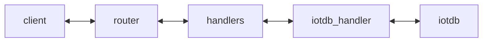

# Information Layer Server (IL)

The information layer Server (IL) is responsible for providing a raw data access [API](#access-information-layer-server-api) (read, write, subscribe).
Its intention is to abstract the underlying data storage database technology. It is written in Typescript.

Clients can interact with it using websockets and JSON payload.

The IL consists of two logical components:

- database handler: Interaction with the chosen database, configurable
- router: API provider that connects to the database handler



# Information Layer Server - Hello World Setup

### Build the typescript application natively

Make sure all libraries are installed

```bash
npm install
```

Build the application

```bash
npm run build
```

Run the unit tests

```bash
npx jest
```

or

```bash
npx jest --verbose
```

## Run IL with IotDB: Timeseries Data Server IoTDB

### Start the database

Start the db:

```bash
docker run -d --rm --name iotdb-service -p 6667:6667 -p 9003:9003 apache/iotdb:latest
```

if you plan on running the Information Layer also with docker, IotDB and IL container need to be in the same network:

```bash
docker network create cdsp-net
docker run -d --rm --name iotdb-service --network cdsp-net -p 6667:6667 -p 9003:9003 apache/iotdb:latest
```

Connect to it via cli to create or view the data (optional):

```bash
docker exec -it iotdb ./start-cli.sh -h 127.0.0.1 -p 6667 -u root -pw root
```

Create a database (optional)

```bash
create database root.Vehicles
```

Create desired timeseries (optional)

```bash
create timeseries root.Vehicles.Vehicle_TraveledDistance WITH DATATYPE=FLOAT, ENCODING=RLE
create timeseries root.Vehicles.Vehicle_Speed WITH DATATYPE=FLOAT, ENCODING=RLE
```

### Start Information Layer Server

Build the Information Layer image

```bash
docker build -t information-layer .
```

Run IL

```bash
# Docker
docker run --rm --name information-layer --network cdsp-net -p 8080:8080 -e HANDLER_TYPE=iotdb -e IOTDB_HOST=iotdb-service information-layer
# OR natively
npm install
HANDLER_TYPE=iotdb IOTDB_HOST=localhost npm start
```

# Access Information Layer Server API

Connect your own websocket client by connecting to `ws://localhost:8080`.

The examples use [websocat](https://github.com/vi/websocat) and [jq](https://github.com/jqlang/jq)

## Get

Schema:

```yaml
# only the root node provided to get all data points
{
  "jsonrpc": "2.0",
  "method": "get",
  "id": "123-456", # this can be any string or number, it is used to match the response with the request
  "params": {
    "instance": "VIN_123",
    "schema": "Vehicle",
    "format": "nested", # this is an optional parameter and sets how the received data should be formatted. It can be either "nested" or "flat". If not provided, the default is "nested"
    "root": "relative" # this is an optional parameter and sets whether the received data should be to the requested path. It can be either "relative" or "absolute". If not provided, the default is "relative"
  }
}
# with path to non-leaf node to get multiple data points below this node
{
  "jsonrpc": "2.0",
  "method": "get",
  "id": "123-456",
  "params": {
    "instance": "VIN_123",
    "schema": "Vehicle",
    "path": "CurrentLocation"
  }
}
# with path to leaf node to get one data point
{
  "jsonrpc": "2.0",
  "method": "get",
  "id": "123-456",
  "params": {
    "instance": "VIN_123",
    "schema": "Vehicle",
    "path": "CurrentLocation.Latitude"
  }
}
```

Example:

```bash
echo '{"jsonrpc":"2.0","method":"get","id":"123-456","params":{"instance":"VIN_123","schema":"Vehicle","path":"Speed"}}' | websocat ws://localhost:8080 -n1 | jq
```

## Set

Schema:

```yaml
# Leaf node with single value in data
{
  "jsonrpc": "2.0",
  "method": "set",
  "id": "123-456",
  "params": {
    "instance": "VIN_123",
    "schema": "Vehicle",
    "path": "CurrentLocation.Latitude",
    "data": 21
  }
}

# Root node with multiple values in data nested and flat (no path provided)
{
  "jsonrpc": "2.0",
  "method": "set",
  "id": "123-456",
  "params": {
    "instance": "VIN_123",
    "schema": "Vehicle",
    "data": {
      "CurrentLocation": {
        "Latitude": 22,
        "Longitude": 46
      },
      "Chassis.SteeringWheel.Angle": 22
    }
  }
}

# Non-leaf node with multiple values in data
{
  "jsonrpc": "2.0",
  "method": "set",
  "id": "123-456",
  "params": {
    "instance": "VIN_123",
    "schema": "Vehicle",
    "path": "CurrentLocation",
    "data": {
      "Latitude": 22,
      "Longitude": 46
    }
  }
}
```

Example:

```bash
echo '{"jsonrpc":"2.0","method":"set","id":"123-456","params":{"instance":"VIN_123","schema":"Vehicle","path":"CurrentLocation.Latitude","data":22}}' | websocat ws://localhost:8080 -n1 | jq
```

```yaml
{ "jsonrpc": "2.0", "id": "123-456", "result": {} }
```

## Subscribe

Schema:

```yaml
{
  "jsonrpc": "2.0",
  "method": "subscribe",
  "id": "123-456", # this can be any string or number, it is used to match the response with the request
  "params":
    { "instance": "VIN_123", "schema": "Vehicle" }
    # "path": "CurrentLocation", # this is an optional parameter and sets the path to subscribe to. If not provided, it subscribes to the root node of the schema,
  "format": "nested", # this is an optional parameter and sets how the received data should be formatted. It can be either "nested" or "flat". If not provided, the default is "nested"
  "root": "relative", # this is an optional parameter and sets whether the received data should be to the requested path. It can be either "relative" or "absolute". If not provided, the default is "relative"
}
```

```bash
echo '{"jsonrpc":"2.0","method":"subscribe","id":"123-456","params":{"instance":"VIN_123","schema":"Vehicle"}}' | websocat ws://localhost:8080 -n | jq
```

On success:

```yaml
{ "jsonrpc": "2.0", "id": "123-456", "result": {} }
```

## Unsubscribe

```yaml
{
  "jsonrpc": "2.0",
  "method": "unsubscribe",
  "id": "123-456",
  "params": { "instance": "VIN_123", "schema": "Vehicle" },
}
```

> [!Note]
> The unsubscribe method matches the subscription based on the provided parameters with the active subscriptions. This means that if the subscription was created with a path, the same path needs to be provided to unsubscribe successfully. Also the instance and schema parameters are required to match the subscription, otherwise the unsubscribe request will not be successful.

On success:

```yaml
{ "jsonrpc": "2.0", "id": "123-456", "result": {} }
```
