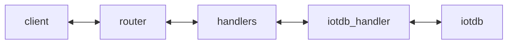

# Information Layer Server (IL)

The information layer Server (IL) is responsible for providing a raw data access [API](#access-information-layer-server-api) (read, write, subscribe).
Its intention is to abstract the underlying data storage database technology. It is written in Typescript.

Clients can interact with it using websockets and JSON payload.

The IL consists of two logical components:

- database handler: Interaction with the chosen database (`iotdb` in current implementation)
- router: API provider that connects to the database handler


```mermaid
flowchart LR
    client <--> router
    router <--> handlers
    handlers <--> iotdb_handler
    iotdb_handler <--> iotdb
```

## Database and Signal Naming

Use these naming rules to run this repository as documented:

- IoTDB database name in this setup: `root.Vehicles`
- Required request field: `params.schema` (examples use `Vehicle`)
- Optional request field: `params.path` (for example `Speed` or `CurrentLocation.Latitude`)
- Supported data points are loaded from `handlers/config/schema-files/vss_data_points.yaml` (copied to `dist/.../schema-files/` during build)

How IL resolves a requested signal internally:

- `schema` and `path` are merged (for example `Vehicle` + `Speed` -> `Vehicle_Speed`)
- dots in path segments are converted to underscores (for example `CurrentLocation.Latitude` -> `CurrentLocation_Latitude`)

Why `path` exists:

- without `path`, API calls target the schema root (`Vehicle`)
- with `path`, API calls target a subtree or one leaf below that schema root

The examples below follow these rules directly so they work out of the box with this repo.

# Information Layer Server - Hello World Setup

### Build the typescript application natively

Make sure all libraries are installed

```bash
npm install
```

Build the application

```bash
npm run build
```

Run the unit tests

```bash
npx jest
```

or

```bash
npx jest --verbose
```

## Run IL with IotDB: Timeseries Data Server IoTDB

### Start the database

Start the db:

```bash
docker run -d --rm --name iotdb-service -p 6667:6667 -p 9003:9003 apache/iotdb:latest
```

if you plan on running the Information Layer also with docker, IotDB and IL container need to be in the same network:

```bash
docker network create cdsp-net
docker run -d --rm --name iotdb-service --network cdsp-net -p 6667:6667 -p 9003:9003 apache/iotdb:latest
```

Connect to it via cli to create or view the data (optional):

```bash
docker exec -it iotdb ./start-cli.sh -h 127.0.0.1 -p 6667 -u root -pw root
```

Create a database (recommended)

```bash
create database root.Vehicles
```

Create desired timeseries (optional)

```bash
create timeseries root.Vehicles.Vehicle_TraveledDistance WITH DATATYPE=FLOAT, ENCODING=RLE
create timeseries root.Vehicles.Vehicle_Speed WITH DATATYPE=FLOAT, ENCODING=RLE
```

### Start Information Layer Server

Build the Information Layer image

```bash
docker build -t information-layer .
```

Run IL

```bash
# Docker
docker run --rm --name information-layer --network cdsp-net -p 8080:8080 -e HANDLER_TYPE=iotdb -e IOTDB_HOST=iotdb-service information-layer
# OR natively
npm install
HANDLER_TYPE=iotdb IOTDB_HOST=localhost npm start
```

# Access Information Layer Server API

Connect your own websocket client by connecting to `ws://localhost:8080`.

The examples use [websocat](https://github.com/vi/websocat) and [jq](https://github.com/jqlang/jq)

## Request Field Meaning (applies to GET/SET/SUBSCRIBE/UNSUBSCRIBE)

Field guide:

- `jsonrpc`: protocol version. Must be `"2.0"`.
- `method`: action to execute (`get`, `set`, `subscribe`, `unsubscribe`).
- `id`: your request identifier. IL copies this value into the response so clients can match request/response.
- `params.instance`: target instance key (for example a VIN-like string). Can be any non-empty text; it is not predefined in config.
  - Practical behavior: if nothing was written yet for this instance, `get` returns no values for it.
- `params.schema`: schema root name from the supported schema file (examples use `Vehicle`).
- `params.path`: optional scope under the schema.
  - omitted -> use schema root
  - set (for example `CurrentLocation`) -> use only that subtree or leaf
- `params.data`: value(s) to write, required only for `set`.
- `params.format`: response shape (`nested` or `flat`) for `get` and `subscribe`.
- `params.root`: how paths are shown in `get`/`subscribe` responses.
  - `relative`: paths are shown relative to your requested scope
  - `absolute`: paths are shown from full schema root
  - defaults: `get` -> `relative`, `subscribe` -> `absolute`

Mapping rule used by IL:

- IL combines `schema` + optional `path` to resolve datapoints (example: `Vehicle` + `Speed` -> `Vehicle_Speed`).

## Get

Request patterns:

```jsonc
// 1) Get all data points below schema root
{
  "jsonrpc": "2.0", // JSON-RPC protocol version
  "method": "get", // read values
  "id": "123-456", // any string/number chosen by client
  "params": { // request parameters
    "instance": "VIN_123", // required; any non-empty text, read/write/subscribe are scoped to this exact value
    "schema": "Vehicle", // required schema name from supported schema file
    "format": "nested", // optional: nested | flat
    "root": "relative" // optional: relative | absolute (relative = shorter paths from requested scope, absolute = full paths)
  }
}

// 2) Get multiple values under a non-leaf path
{
  "jsonrpc": "2.0", // JSON-RPC protocol version
  "method": "get", // read values
  "id": "123-456", // client request ID
  "params": { // request parameters
    "instance": "VIN_123", // required; same text must be used to read this instance later
    "schema": "Vehicle", // required schema name
    "path": "CurrentLocation" // optional: select only this subtree under schema
  }
}

// 3) Get one specific leaf value
{
  "jsonrpc": "2.0", // JSON-RPC protocol version
  "method": "get", // read values
  "id": "123-456", // client request ID
  "params": { // request parameters
    "instance": "VIN_123", // required instance value
    "schema": "Vehicle", // required schema name
    "path": "CurrentLocation.Latitude" // optional: one concrete leaf signal
  }
}
```

Example:

```bash
echo '{"jsonrpc":"2.0","method":"get","id":"123-456","params":{"instance":"VIN_123","schema":"Vehicle","path":"Speed"}}' | websocat ws://localhost:8080 -n1 | jq
```

## Set

Request patterns:

```jsonc
// 1) Set one leaf value
{
  "jsonrpc": "2.0", // JSON-RPC protocol version
  "method": "set", // write values
  "id": "123-456", // client request ID
  "params": { // request parameters
    "instance": "VIN_123", // required; any non-empty text (you can choose it), writes are stored under this instance value
    "schema": "Vehicle", // required schema name
    "path": "CurrentLocation.Latitude", // optional: write this single leaf signal
    "data": 21 // required set payload (leaf scalar)
  }
}

// 2) Set multiple values at schema root (mixed nested/flat keys)
{
  "jsonrpc": "2.0", // JSON-RPC protocol version
  "method": "set", // write values
  "id": "123-456", // client request ID
  "params": { // request parameters
    "instance": "VIN_123", // required instance value
    "schema": "Vehicle", // required schema name
    "data": { // required set payload (root object)
      "CurrentLocation": { // nested object key
        "Latitude": 22, // leaf value
        "Longitude": 46 // leaf value
      }, // end nested object
      "Chassis.SteeringWheel.Angle": 22 // flat-path leaf value
    } // end data
  }
}

// 3) Set multiple values under a non-leaf path
{
  "jsonrpc": "2.0", // JSON-RPC protocol version
  "method": "set", // write values
  "id": "123-456", // client request ID
  "params": { // request parameters
    "instance": "VIN_123", // required instance value
    "schema": "Vehicle", // required schema name
    "path": "CurrentLocation", // optional: write this subtree only
    "data": { // required set payload (subtree object)
      "Latitude": 22, // leaf value
      "Longitude": 46 // leaf value
    } // end data
  }
}
```

Example:

```bash
echo '{"jsonrpc":"2.0","method":"set","id":"123-456","params":{"instance":"VIN_123","schema":"Vehicle","path":"CurrentLocation.Latitude","data":22}}' | websocat ws://localhost:8080 -n1 | jq
```

```yaml
{ "jsonrpc": "2.0", "id": "123-456", "result": {} }
```

## Subscribe

Request:

```jsonc
{
  "jsonrpc": "2.0", // JSON-RPC protocol version
  "method": "subscribe", // start subscription
  "id": "123-456", // client request ID
  "params": { // request parameters
    "instance": "VIN_123", // required; any non-empty text, subscription is bound to this exact instance value
    "schema": "Vehicle", // required schema name
    "path": "CurrentLocation", // optional: if omitted, subscribes from schema root
    "format": "nested", // optional: nested | flat
    "root": "relative" // optional: relative | absolute (if omitted: absolute; absolute includes full schema path)
  }
}
```

```bash
echo '{"jsonrpc":"2.0","method":"subscribe","id":"123-456","params":{"instance":"VIN_123","schema":"Vehicle"}}' | websocat ws://localhost:8080 -n | jq
```

On success:

```yaml
{ "jsonrpc": "2.0", "id": "123-456", "result": {} }
```

## Unsubscribe

```jsonc
{
  "jsonrpc": "2.0", // JSON-RPC protocol version
  "method": "unsubscribe", // stop subscription
  "id": "123-456", // client request ID
  "params": { // request parameters
    "instance": "VIN_123", // required; must match the subscribed instance value
    "schema": "Vehicle", // required schema name
    "path": "CurrentLocation" // include path if your subscribe used path
  }
}
```

> [!Note]
> The unsubscribe method matches active subscriptions by websocket client + `instance` + exact resolved datapoint set (derived from `schema` and optional `path`). Use the same subscribe scope to unsubscribe reliably.

On success:

```yaml
{ "jsonrpc": "2.0", "id": "123-456", "result": {} }
```

## Common Pitfalls

- Creating `root.Vehicles` in IoTDB is required before using IL as shown here.
- `schema` + `path` must point to known data points from the configured schema file.
- For `set`, make sure `data` shape matches your `path` scope:
  - leaf path -> scalar value
  - non-leaf/root path -> object with child values
- For `unsubscribe`, send the same instance and scope used in the active `subscribe` request.
