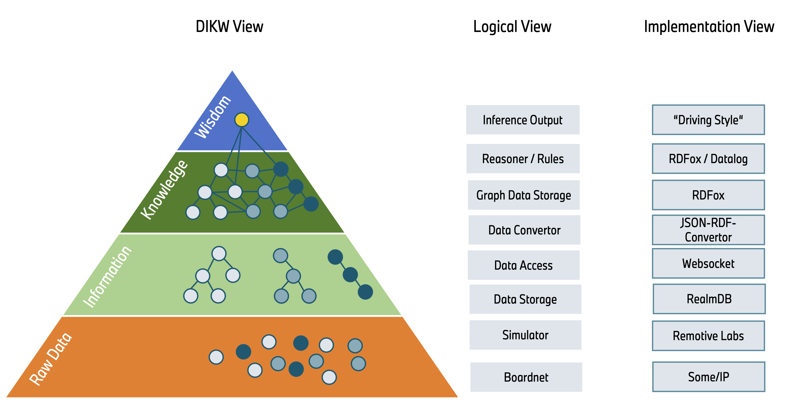

# Knowledge Layer "Hello World" Use Case: Driving Style Detector

## Why?

This repository demonstrates a simple "Hello World" application of the Knowledge Layer, whose joint development was [proposed](https://wiki.covesa.global/pages/viewpage.action?pageId=71074417) in the COVESA Data Architecture working group. Given the generic nature of the underlying architecture, this use case can serve as a starting point for implementing more complex scenarios across various domains. One major advantage is that the use case is built on logical [playground components](../../cdsp/README.md). These components can often be swapped out (based on availability of alternatives) without significantly impacting other components (sometimes even not at all, e.g., whether using [RealmDB](../../cdsp/information-layer/handlers/src/realmdb/README.md) or [IoTDB](../../cdsp/information-layer/handlers/src/iotdb/README.md), it does not affect the Knowledge Layer).

### Key Aspects Illustrated:
- **Standardized Data Models:** Using models like [VSS](https://github.com/COVESA/vehicle_signal_specification/) and associated tools enables scalable, generic transformation of data into other formats, like graph data formats.
- **Logic Mapping in Data-Driven Rules:** Instead of hardcoded IF-ELSE logic, data-driven rules like [Datalog](https://en.wikipedia.org/wiki/Datalog) offer:
  - Easier maintenance of logic
  - Functional logic without the need for compilation
  - Smaller size for necessary updates
  - Easier traceability of decisions through declarative logic description
  - Centralized executable knowledge instead of scattered functional logic
- **No Over-Reliance on Machine Learning:** AI is not only Machine Learning, and Machine Learning isn't always the solution.
- **Uniform Implementation Pattern:** Offers a domain-independent pattern for other use cases.

## What?

In this use case, we have implemented an AI-powered solution to detect aggressive driving behaviours. Rather than relying on complex, maintenance-intensive IF-ELSE logic in code or overly sophisticated machine learning models, the detection is achieved through straightforward, data-driven rules.

## How?

Live VSS data from the current drive made accessible in the [Information Layer Server](../../cdsp/information-layer/README.md) via [Websocket](../../cdsp/information-layer/router/src/websocket-server.ts) are converted by a [JSON-RDF-Convertor](../../cdsp/knowledge-layer/connector/README.md) in real-time into a graph data format ([RDF](https://www.w3.org/RDF/)) and stored within the Knowledge Layer in a [Knowledge Graph](https://en.wikipedia.org/wiki/Knowledge_Graph). At any point, every data point (needed for the use case) in the Information Layer has a graph representation. This data representation allows us to attach a [symbolic reasoner](../../cdsp/knowledge-layer/symbolic-reasoner/README.md) ([RDFox](../../cdsp/knowledge-layer/symbolic-reasoner/rdfox/README.md)) to the Knowledge Graph, which can link, evaluate, and infer new facts based on rules, such as deriving the driving style. As soon as an aggressive driving style is detected, the result is converted back from the graph data format to an Information Layer tree format in real time and, in our case, stored in the appropriate data field in the VSS tree.  The information "aggressive driving style" can then be shared with other interested applications for example via a data sync middleware.

### Implementation Details

#### Logical Components and Implementation Decisions:
- **Data Model:** [VSS](https://github.com/COVESA/vehicle_signal_specification/) - Describes vehicle data in a standardized format
- **Simulator:** [Remotive Labs](../../examples/remotivelabs-feeder/README.md) - Provides raw data for a test drive
- **DB Handler:** [RealmDB](../../cdsp/information-layer/handlers/src/realmdb/README.md), [IoTDB](../../cdsp/information-layer/handlers/src/iotdb/README.md) - Abstracts data store details
- **DB Router:** [WebSocket Server](../../cdsp/information-layer/router/src/websocket-server.ts) - Provides read,
write and subscribe capabilities to VSS data via a websocket server
- **Connector:** [Knowledge Layer Connector](../../cdsp/knowledge-layer/connector/README.md) - Connects Knowledge Layer to Information Layer via websocket client and manages data tasks within Knowledge Layer
- **Convertor:** [JSON-RDF-Converter](../../cdsp/knowledge-layer/connector/json-rdf-convertor/README.md) - Converts tree-like data (json) into graph data (RDF) and vice versa
- **Reasoner Adapter:** [RDFox Adaptor](../../cdsp/knowledge-layer/symbolic-reasoner/README.md) - Converts tree-like data (json) into graph data (RDF) and vice versa
- **Rules Language:** [Datalog](https://en.wikipedia.org/wiki/Datalog) - Allows describing IF-ELSE like rules in data-near language
- **Knowledge Graph and Reasoner:** [RDFox](../../cdsp/knowledge-layer/symbolic-reasoner/rdfox/README.md) - Stores the transformed and newly generated graph data, reasons based on rules and graph data, potentially inferring new graph data



#### Input, Use Case Logic and Output:

Our input data for the use case includes:
- `Vehicle.Chassis.SteeringWheel.Angle`: The current angle of the steering wheel.
- `Vehicle.CurrentLocation.Latitude`: The latitude of the vehicle's current location.
- `Vehicle.CurrentLocation.Longitude`: The longitude of the vehicle's current location.
- `Vehicle.Speed`: The current speed of the vehicle.

The core logic of our use case is represented by the following rule (here in natural language for better readability):

<pre data-toolbar-order="disclaimer,copy-code,show-language" class="language-plaintext" style="border-radius: 0.5rem;"><code class="language-plaintext">If Vehicle.Chassis.SteeringWheel.Angle changes by more than 90 degrees in less than 3 seconds and Vehicle.Speed is greater than 50 km/h, then flag as aggressive driving.</code></pre>

Derived output data:
- `Vehicle.AI.Reasoner.InferenceResults`: Infered driving style details are written into this data node

## Installation and Running

### Remotive Labs and RDFOX Credentials Setup

1. Create a [Remotive Labs](https://remotivelabs.com/) account.
2. Navigate to `Recordings`, select `Night drive to Luftkastellet`, and start the recording with the `Play` button. Wait until it starts playing, then stop the recording for now. This creates a broker for you, and we need its credentials next.
3. Navigate to the `Brokers` section and open `My personal broker`.
4. Copy the URL and API key to the environment variables in the [.env](.env) file: `REMOTIVE_LABS_BROKER_URL` and `REMOTIVE_LABS_BROKER_API_KEY`.
5. You need to acquire the `RDFox.lic` license file from [Oxford Semantic Technologies](https://www.oxfordsemantic.tech/).
6. Place it in the folder [examples/shared-config/rdfox](../shared-config/rdfox).

### Run Use Case

1. Log in to [Remotive Labs](https://remotivelabs.com/).
2. Select `Night drive to Luftkastellet` in the `Recordings` section, open the `Files` tab, and drag and drop the zip file `examples/shared-config/remotive-labs/config_vss_aggressive_driving.zip` into the `Signal Transformations` section.
3. Navigate to the `Playback` tab, select `config_vss_aggressive_driving` as the `signal transformation`, and press the `Play` button.
4. If the recording starts playing, stop it for now to proceed with setup.
5. Start all services with a single terminal command from the current folder ([knowledgelayer-hello-world]()). Make sure you have installed `Docker` and `Docker Compose`.
   ```bash
   docker compose up
   ```
6. Wait until all containers are created and started.
7. Continue playing the `Night drive to Luftkastellet` on `Remotive Labs` page. You should see a lot of logs in the terminal indicating that data is flowing. 
8. Knowledge Layer will generate triples in [KL-config/output/triples](KL-config/output/triples) folder and the reasoner responses that are send to Information Layer in [KL-config/output/reasoning_output](KL-config/output/reasoning_output)
9. To stop and delete the docker containers you can use
  ```bash
  docker compose down
  ```
---

Feel free to explore the components and rules used in this "Hello World" example to understand the basic implementation of the Knowledge Layer. You can extend this use case to more complex scenarios and even adapt it to different domains.
