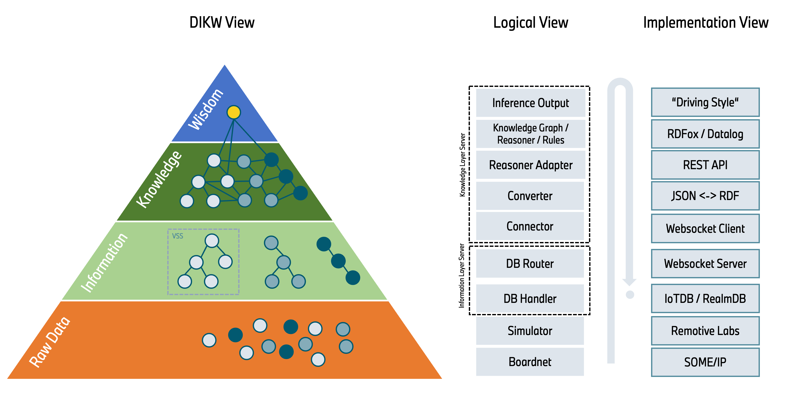

# Knowledge Layer "Hello World" Use Case: Driving Style Detector

## Why?

This repository demonstrates a simple "Hello World" application of the Knowledge Layer, whose joint development was [proposed](https://wiki.covesa.global/pages/viewpage.action?pageId=71074417) in the COVESA Data Architecture working group. Given the generic nature of the underlying architecture, this use case can serve as a starting point for implementing more complex scenarios across various domains. One major advantage is that the use case is built on logical [playground components](../../cdsp/README.md). These components can often be swapped out (based on availability of alternatives) without significantly impacting other components (sometimes even not at all, e.g., whether using [RealmDB](../../cdsp/information-layer/handlers/src/realmdb/README.md) or [IoTDB](../../cdsp/information-layer/handlers/src/iotdb/README.md), it does not affect the Knowledge Layer).

### Key Aspects Illustrated:
- **Standardized Data Models:** Using models like [VSS](https://github.com/COVESA/vehicle_signal_specification/) and associated tools enables scalable, generic transformation of data into other formats, like graph data formats.
- **Logic Mapping in Data-Driven Rules:** Instead of hardcoded IF-ELSE logic, data-driven rules like [Datalog](https://de.wikipedia.org/wiki/Datalog) offer:
  - Easier maintenance of logic
  - Functional logic without the need for compilation
  - Smaller size for necessary updates
  - Easier traceability of decisions through declarative logic description
  - Centralized executable knowledge instead of scattered functional logic
- **No Over-Reliance on Machine Learning:** AI is not only Machine Learning, and Machine Learning isn't always the solution.
- **Uniform Implementation Pattern:** Offers a domain-independent pattern for other use cases.

## What?

In this use case, we have implemented an AI-powered solution to detect aggressive driving behaviors. Rather than relying on complex, maintenance-intensive IF-ELSE logic in code or overly sophisticated machine learning models, the detection is achieved through straightforward, data-driven rules.

## How?

Live VSS data from the current drive made accesible in the [Information Layer](../../cdsp/information-layer/README.md) via [Websocket](../../cdsp/information-layer/router/src/websocket-server.js) are converted by a [JSON-RDF-Convertor](../../cdsp/knowledge-layer/connector/README.md) in real-time into a graph data format ([RDF](https://www.w3.org/RDF/)) and stored within the Knowledge Layer in a [Knowledge Graph](https://en.wikipedia.org/wiki/Knowledge_Graph). At any point, every data point (needed for the use case) in the Information Layer has a graph representation. This data representation allows us to attach a [symbolic reasoner](../../cdsp/knowledge-layer/symbolic-reasoner/README.md) ([RDFox](../../cdsp/knowledge-layer/symbolic-reasoner/rdfox/README.md)) to the Knowledge Graph, which can link, evaluate, and infer new facts based on rules, such as deriving the driving style. As soon as an aggressive driving style is detected, the result is converted back from the graph data format to an Informtion Layer tree format in real time and, in our case, stored in the appropriate data field in the VSS tree.  The information "aggressive driving style" can then be shared with other interested applications for example via a data sync middleware.

### Implementation Details

#### Logical Components and Implementation Decisions:
- **Data Model:** [VSS](https://github.com/COVESA/vehicle_signal_specification/) - Describes vehicle data in a standardized format
- **Feeder/Simulator:** [Remotive Labs](../../examples/remotivelabs-feeder/README.md) - Provides raw data for a test drive
- **Data Storage:** [RealmDB](../../cdsp/information-layer/handlers/src/realmdb/README.md) - Stores live data
- **Data Access:** [WebSocket Interface](../../cdsp/information-layer/router/src/websocket-server.js) - Read,
write, subscribe to VSS data
- **Knowledge Layer Connector:** [RDFConvertor](../../cdsp/knowledge-layer/connector/README.md) - Converts VSS JSON format into RDF Graph format and vice versa
- **Graph Data Storage:** [RDFox](../../cdsp/knowledge-layer/symbolic-reasoner/rdfox/README.md) - Stores the transformed and newly generated graph data
- **Rules Language:** [Datalog](https://de.wikipedia.org/wiki/Datalog) - Allows describing IF-ELSE like rules in data-near language
- **Data-Reasoner:** [RDFox](../../cdsp/knowledge-layer/symbolic-reasoner/rdfox/README.md) - Reasons based on rules and graph data, potentially inferring new graph data

#### Input, Use Case Logic and Output:

Our input data for the use case includes:
- `Vehicle.Chassis.SteeringWheel.Angle`: The current angle of the steering wheel.
- `Vehicle.CurrentLocation.Latitude`: The latitude of the vehicle's current location.
- `Vehicle.CurrentLocation.Longitude`: The longitude of the vehicle's current location.
- `Vehicle.Powertrain.TractionBattery.NominalVoltage`: The nominal voltage of the vehicle's traction battery.
- `Vehicle.Powertrain.TractionBattery.StateOfCharge.CurrentEnergy`: The current energy level of the traction battery.
- `Vehicle.Powertrain.Transmission.CurrentGear`: The current gear of the vehicle's transmission.
- `Vehicle.Speed`: The current speed of the vehicle.

The core logic of our use case is represented by the following rule (here in natural language for better readability):

<pre data-toolbar-order="disclaimer,copy-code,show-language" class="language-plaintext" style="border-radius: 0.5rem;"><code class="language-plaintext">If Vehicle.Chassis.SteeringWheel.Angle changes by more than 90 degrees in less than 3 seconds and Vehicle.Speed is greater than 50 km/h, then flag as aggressive driving.</code></pre>

Derived output data:
- `Vehicle.drivingStyle`: True, when driving style is aggressive, otherwise false

## Installation and Running

To be determined (TBD).

---

Feel free to explore the components and rules used in this "Hello World" example to understand the basic implementation of the Knowledge Layer. You can extend this use case to more complex scenarios and even adapt it to different domains.
