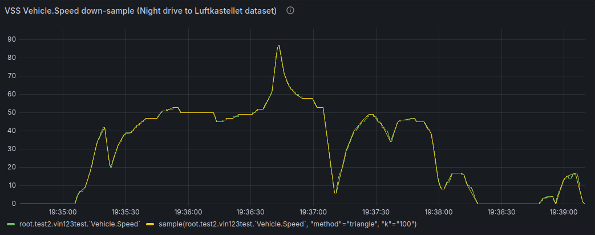
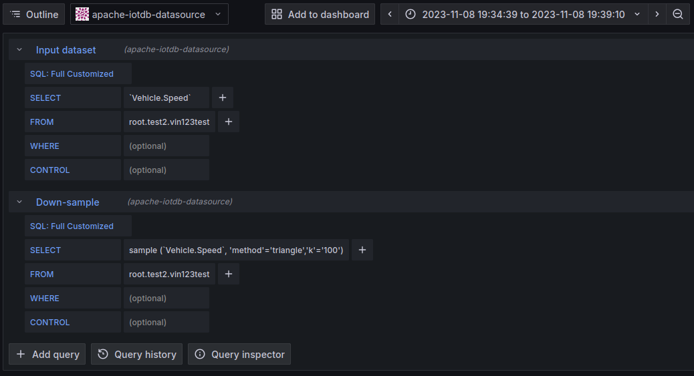

# VSS Vehicle.Speed down-sample example
This is an example of using the Central Data Service Playground (CDSP) to transform timeseries data using the Apache IoTDB data store. It accurately down-samples a timeseries of pre-recorded high frequency VSS `Vehicle.Speed` data.

## Logical Concept
In a data centric architecture the data/information layers can efficiently support ETL/ELT (Extract, Transform, Load) style operations. Timeseries data can be efficiently stored and retrieved by a timeseries database for example. Some databases will also provide the transform operation. This frees developers to concentrate on data architecture, algorithm selection and business logic.

### Example scenario: journey analysis
Processing could follow the following steps:

1) A vehicle could generate a day's worth of high frequency GPS location data which is stored in a database as the timeseries `day-journey`.

2) At the end of each day the `day-journey` timeseries could be down-sampled and stored in a new timeseries `day-journey-upload`. The down-sampling performed by an intelligent algorithm that retains important information whilst greatly reducing the number of data points.

3) The `day-journey-upload` timeseries can then be used as input to the vehicle's car2cloud subsystem to upload to the cloud for further ETL/ELT processing, e.g. identification of regular routes for use in an assistant.

In-vehicle processing like this can save in-vehicle network bandwidth, whilst also significantly reducing data transmission costs in the upload.

Additionally, with the focus on a data centric architecture the same data models and processes can be used both in-vehicle and the cloud.

### Other scenarios
The same pattern can be applied to other scenarios such as diagnostics for component health, or driver monitoring.

Hybrids of in-vehicle and off-board analysis allow flexible reduction of transmission, storage and processing costs and network load.

## Implementation
In this section we will summarise how we implemented the extraction of the real drive data into VSS, loaded it into the database and transformed it.

### Dataset (extract)
The supporting file `vehicle_speed_rl_dataset.csv` contains a dataset of `Vehicle.Speed` data in the VSS data model for you to experiment with and which we will use throughout the following examples. The file format is Comma-separated values (CSV) for wide compatibility.

The pre-recorded data comes from a real car journey *Night drive to Luftkastellet* captured by [RemotiveLabs](https://remotivelabs.com/) as an example for their cloud platform. RemotiveLabs kindly gave permission for the speed data to be used for this Playground example.

The dataset contains just over 13500 values recorded over approximately 5 minutes at 20ms intervals.

### Load
In the example we will import the dataset into a VSS `Vehicle.Speed` timeseries within IoTDB.

IoTDB provides [import/export tools](https://iotdb.apache.org/UserGuide/latest/Tools-System/TsFile-Import-Export-Tool.html) for its native TsFile file format and CSV and which are included in the image. We will use the [`import-csv.sh`](https://iotdb.apache.org/UserGuide/latest/Tools-System/TsFile-Import-Export-Tool.html#usage-of-import-csv-sh) tool to perform the import.

### Transform
IoTDB has a library of Data Quality functions which includes the function [`Sample`](https://iotdb.apache.org/UserGuide/latest/Reference/UDF-Libraries.html#sample) for sampling. Sample has three sampling methods: `Reservoir`, `Isometric` and `Triangle`. 

Sample function:

+ *Input*: A single timeseries of arbitrary data type is taken as the input.

+ *Output*: The output is also a single timeseries, of the same type.

+ *Parameters*: 

    `method` specifies the method to use for the sampling.

    `k` specifies the number of samples to be output and must be a positive integer. By default, it's 1. If k is greater than the length of the input series, all data points in the input series will be output.

As the most intelligent algorithm of the three methods, that balances accurately representing the data, whilst supporting significant data reduction, our example uses the `Triangle` method to down-sample the 13500 input samples to 100.

To perform the down-sample the `Sample` function is executed as part of an SQL query that takes the input timeseries and returns the down-sampled data:
~~~sql
select sample(`Vehicle.Speed`,'method'='triangle','k'='100') from root.test2.vin123test
~~~

The following screenshot shows the results graphed in Grafana. The green graph is the input data, the yellow graph the down-sampled data. We can see that the result accurately traces the input data.

*Figure 1: Grafana visualisation of the results. Key: Green=input data, yellow=down-sampled result*

Tips:
+ Documentation for each Sample method and the other functions can be found in the [IoTDB library documentation](https://iotdb.apache.org/UserGuide/latest/Reference/UDF-Libraries.html).

+ Triangle uses a *Largest-Triangle-Three-Buckets (LTTB)* algorithm to calculate the output timeseries. Details of which can be found in the originating academic research: [Downsampling Time Series for Visual Representation, Sveinn Steinarsson, 2013](https://skemman.is/bitstream/1946/15343/3/SS_MSthesis.pdf)

### Notes on other methods
*Live data*: In this example we have used a fixed dataset as input as it helps understand the results, especially when graphed.

To use live data instead you simply need to write it to the database. The Playground provides the [RemotiveLabs feeder](https://github.com/COVESA/cdsp/tree/main/examples/remotivelabs-feeder) which can be used as a bridge to stream live data from the RemotiveLabs cloud platform. Alternatively, you could write some glue code between your source and the database.

*Algorithms*: The example uses the intelligent sampling algorithm LTTB. IoTDB has other methods built-in and within the Data Quality library for you to try if you wish. Simply change the SQL query.

If you wish to try algorithms not implemented in IoTDB one starting point would be to use its efficient storage and retrieval of timeseries data to store and retrieve the data and do the sampling in your own code. As a second step, IoTDB allows you write User Defined Functions (UDF) and this could be used to integrate the new algorithm and call it like any other function. This could be used to integrate the CurveLogic algorithm for example.

*Programmed*: Whilst the example uses interactive methods, the same can easily be codified.

## How-To Tutorial
Having explained the implementation in the previous section, in this section we will provide a How-To to illustrate the steps.

We will use the IoTDB CLI client to send SQL commands on its command line to the database.
### Preparation
1. Open a terminal. We will use this to run docker commands.
2. Open another terminal. We will use this to run the IoTDB CLI client.
3. Start the Playground if it is not already running.
    ~~~
    $ docker compose -f docker-compose-cdsp.yml up -d
    ~~~
4. Start the IoTDB CLI client
    ~~~
    $ docker exec -ti iotdb-service /iotdb/sbin/start-cli.sh -h iotdb-service
    ~~~

#### Data Quality Library setup
The IoTDB Data Library is an optional install. To call the functions they must first be registered in the running IoTDB instance, which you only need to do once. The script /iotdb/sbin/register-UDF.sh is included in the IoTDB image to do this for you.

Execute the script using the Docker `exec` command:

~~~
$ sudo docker exec -ti iotdb-service /iotdb/sbin/register-UDF.sh
~~~

Info: See the online documentation site for [details](https://covesa.github.io/cdsp/manuals/apache-iotdb/#setup)

### Import the dataset

1. Create the database in IoTDB into which we will import

    Using the IoTDB CLI client:
    ~~~sql
    IoTDB> create database root.test2
    ~~~
    Info: The `root.test2` database is commonly used in Playground documentation and therefore may already exist in your instance. The command will simply report that fact if it does.

2. Import the dataset into IoTDB

    2.1. Copy the dataset file to a volume visible within the IoTDB image:
    ~~~
    $ cp vehicle_speed_rl_dataset.csv ../../docker/data
    ~~~

    2.2. Import the dataset

    To import the dataset into IoTDB we need to execute the `import-csv.sh` tool in the IoTDB image. That can be done from the host terminal using the docker `exec` command.
    ~~~
    $ docker exec -ti iotdb-service /iotdb/tools/import-csv.sh -h iotdb-service -p 6667 -u root -pw root -f /iotdb/data/vehicle_speed_rl_dataset.csv
    ~~~

    Example successful execution:
    ~~~
    $ docker exec -ti iotdb-service /iotdb/tools/import-csv.sh -h iotdb-service -p 6667 -u root -pw root  -f /iotdb/data/vehicle_speed_rl_dataset.csv
    ------------------------------------------
    Starting IoTDB Client Import Script
    ------------------------------------------
    Import completely!
    ~~~

3. Optional: You can check your import by querying the timeseries using the IoTDB CLI client:

    Example 1: Query how many values are in the timeseries:
    ~~~sql
    IoTDB> select count(`Vehicle.Speed`) from root.test2.vin123test
    +--------------------------------------------+
    |count(root.test2.vin123test.`Vehicle.Speed`)|
    +--------------------------------------------+
    |                                       13520|
    +--------------------------------------------+
    Total line number = 1
    It costs 0.006s
    ~~~

    Example 2: Query the data values in the timeseries:
    ~~~sql
    IoTDB> select `Vehicle.Speed` from root.test2.vin123test limit 7
    +------------------------+-------------------------------------+
    |                    Time|root.test2.vin123test.`Vehicle.Speed`|
    +------------------------+-------------------------------------+
    |2023-11-08T19:34:39.651Z|                                  0.0|
    |2023-11-08T19:34:39.663Z|                                  0.0|
    |2023-11-08T19:34:39.679Z|                                  0.0|
    |2023-11-08T19:34:39.699Z|                                  0.0|
    |2023-11-08T19:34:39.718Z|                                  0.0|
    |2023-11-08T19:34:39.740Z|                                  0.0|
    |2023-11-08T19:34:39.759Z|                                  0.0|
    +------------------------+-------------------------------------+
    Total line number = 7
    It costs 0.021s
    ~~~

### Down-sample the data
In the previous steps we imported the dataset `vehicle_speed_rl_dataset.csv` into the timeseries `` root.test2.vin123test.`Vehicle.Speed` `` in IoTDB. Now we will down-sample the timeseries using an SQL query that uses the `Sample` function. The queries will be executed in the IoTDB CLI client.

SQL queries can contain a wide range of optional clauses to determine the data that is processed. For example, you can limit the query to a specific time range to isolate a specific journey for the [example scenario](#example-scenario-journey-analysis) at the start of this document.

For this How-To we will concentrate on using two simple query statements:
1. `SELECT SAMPLE() FROM <ts1>` which down-samples timeseries ts1 and returns the result
2. `SELECT SAMPLE() INTO <ts2> FROM <ts1>` which down-samples timeseries ts1 and places the result *INTO* timeseries ts2.

#### Example query 1: Down-sample to 100 samples and return the result
SQL query to down-sample timeseries `` root.test2.vin123test.`Vehicle.Speed` `` to 100 samples and return the result:

~~~sql
select sample(`Vehicle.Speed`,'method'='triangle','k'='100') from root.test2.vin123test
~~~

Example IoTDB CLI client query result..

~~~sql
IoTDB> select sample(`Vehicle.Speed`,'method'='triangle','k'='100') from root.test2.vin123test
+------------------------+-----------------------------------------------------------------------------+
|                    Time|sample(root.test2.vin123test.`Vehicle.Speed`, "method"="triangle", "k"="100")|
+------------------------+-----------------------------------------------------------------------------+
|2023-11-08T19:34:39.651Z|                                                                          0.0|
|2023-11-08T19:34:39.663Z|                                                                          0.0|
|2023-11-08T19:34:42.398Z|                                                                          0.0|
|2023-11-08T19:34:45.140Z|                                                                          0.0|
|2023-11-08T19:34:47.877Z|                                                                          0.0|
|2023-11-08T19:34:50.618Z|                                                                          0.0|
|2023-11-08T19:34:53.356Z|                                                                          0.0|
|2023-11-08T19:34:56.096Z|                                                                          0.0|
|2023-11-08T19:34:58.840Z|                                                                          0.0|
|2023-11-08T19:35:04.295Z|                                                                          0.0|
|2023-11-08T19:35:05.878Z|                                                                          0.0|
|2023-11-08T19:35:07.416Z|                                                                          6.0|
|2023-11-08T19:35:10.595Z|                                                                          9.0|
|2023-11-08T19:35:13.255Z|                                                                         18.0|
|2023-11-08T19:35:16.335Z|                                                                         34.0|
|2023-11-08T19:35:19.995Z|                                                                         42.0|
|2023-11-08T19:35:22.395Z|                                                                         21.0|
|2023-11-08T19:35:23.654Z|                                                                         22.0|
|2023-11-08T19:35:26.335Z|                                                                         32.0|
|2023-11-08T19:35:29.134Z|                                                                         38.0|
|2023-11-08T19:35:32.875Z|                                                                         39.0|
|2023-11-08T19:35:34.454Z|                                                                         42.0|
|2023-11-08T19:35:39.673Z|                                                                         47.0|
|2023-11-08T19:35:42.653Z|                                                                         47.0|
|2023-11-08T19:35:45.153Z|                                                                         47.0|
|2023-11-08T19:35:47.453Z|                                                                         51.0|
|2023-11-08T19:35:49.431Z|                                                                         51.0|
|2023-11-08T19:35:52.772Z|                                                                         53.0|
|2023-11-08T19:35:55.331Z|                                                                         53.0|
|2023-11-08T19:35:56.371Z|                                                                         50.0|
|2023-11-08T19:35:59.110Z|                                                                         50.0|
|2023-11-08T19:36:01.850Z|                                                                         50.0|
|2023-11-08T19:36:04.590Z|                                                                         50.0|
|2023-11-08T19:36:10.049Z|                                                                         50.0|
|2023-11-08T19:36:12.109Z|                                                                         50.0|
|2023-11-08T19:36:13.449Z|                                                                         45.0|
|2023-11-08T19:36:16.569Z|                                                                         45.0|
|2023-11-08T19:36:18.288Z|                                                                         47.0|
|2023-11-08T19:36:21.369Z|                                                                         47.0|
|2023-11-08T19:36:24.209Z|                                                                         49.0|
|2023-11-08T19:36:29.228Z|                                                                         49.0|
|2023-11-08T19:36:30.648Z|                                                                         49.0|
|2023-11-08T19:36:33.167Z|                                                                         52.0|
|2023-11-08T19:36:35.847Z|                                                                         52.0|
|2023-11-08T19:36:39.967Z|                                                                         61.0|
|2023-11-08T19:36:42.746Z|                                                                         86.0|
|2023-11-08T19:36:43.466Z|                                                                         87.0|
|2023-11-08T19:36:45.908Z|                                                                         71.0|
|2023-11-08T19:36:48.425Z|                                                                         64.0|
|2023-11-08T19:36:51.446Z|                                                                         60.0|
|2023-11-08T19:36:54.625Z|                                                                         58.0|
|2023-11-08T19:36:59.365Z|                                                                         58.0|
|2023-11-08T19:37:01.726Z|                                                                         53.0|
|2023-11-08T19:37:04.507Z|                                                                         53.0|
|2023-11-08T19:37:05.264Z|                                                                         48.0|
|2023-11-08T19:37:10.043Z|                                                                          6.0|
|2023-11-08T19:37:10.803Z|                                                                          6.0|
|2023-11-08T19:37:15.623Z|                                                                         29.0|
|2023-11-08T19:37:18.364Z|                                                                         37.0|
|2023-11-08T19:37:19.483Z|                                                                         40.0|
|2023-11-08T19:37:23.022Z|                                                                         45.0|
|2023-11-08T19:37:26.524Z|                                                                         49.0|
|2023-11-08T19:37:28.744Z|                                                                         49.0|
|2023-11-08T19:37:30.901Z|                                                                         45.0|
|2023-11-08T19:37:32.481Z|                                                                         44.0|
|2023-11-08T19:37:36.727Z|                                                                         34.0|
|2023-11-08T19:37:40.400Z|                                                                         45.0|
|2023-11-08T19:37:41.400Z|                                                                         46.0|
|2023-11-08T19:37:43.223Z|                                                                         46.0|
|2023-11-08T19:37:48.659Z|                                                                         47.0|
|2023-11-08T19:37:49.099Z|                                                                         45.0|
|2023-11-08T19:37:52.879Z|                                                                         45.0|
|2023-11-08T19:37:56.399Z|                                                                         38.0|
|2023-11-08T19:37:59.638Z|                                                                         14.0|
|2023-11-08T19:38:01.118Z|                                                                          8.0|
|2023-11-08T19:38:02.558Z|                                                                          8.0|
|2023-11-08T19:38:06.476Z|                                                                         17.0|
|2023-11-08T19:38:10.597Z|                                                                         17.0|
|2023-11-08T19:38:12.077Z|                                                                         16.0|
|2023-11-08T19:38:13.677Z|                                                                         10.0|
|2023-11-08T19:38:18.776Z|                                                                          0.0|
|2023-11-08T19:38:18.834Z|                                                                          0.0|
|2023-11-08T19:38:21.594Z|                                                                          0.0|
|2023-11-08T19:38:24.335Z|                                                                          0.0|
|2023-11-08T19:38:27.074Z|                                                                          0.0|
|2023-11-08T19:38:29.813Z|                                                                          0.0|
|2023-11-08T19:38:32.555Z|                                                                          0.0|
|2023-11-08T19:38:35.293Z|                                                                          0.0|
|2023-11-08T19:38:38.033Z|                                                                          0.0|
|2023-11-08T19:38:40.772Z|                                                                          0.0|
|2023-11-08T19:38:46.232Z|                                                                          0.0|
|2023-11-08T19:38:48.153Z|                                                                          0.0|
|2023-11-08T19:38:49.773Z|                                                                          3.0|
|2023-11-08T19:38:54.453Z|                                                                          4.0|
|2023-11-08T19:38:56.091Z|                                                                          0.0|
|2023-11-08T19:38:59.751Z|                                                                         13.0|
|2023-11-08T19:39:00.932Z|                                                                         15.0|
|2023-11-08T19:39:05.410Z|                                                                         17.0|
|2023-11-08T19:39:08.790Z|                                                                          1.0|
|2023-11-08T19:39:10.010Z|                                                                          0.0|
+------------------------+-----------------------------------------------------------------------------+
Total line number = 100
It costs 0.117s
IoTDB>
~~~

#### Example query 2: Down-sample and store result in new timeseries
The IoTDB SQL syntax provides the `INTO` clause which stores the result in a new timeseries. This is especially useful for internal ETL/ELT (Extract, Transform, Load) style operations. For example this could be used to prepare the end of day upload of data described in the [example scenario](#example-scenario-journey-analysis) at the start of this document.

Extend the example 1 SQL query statement to place the result in a new timeseries `root.test2.vin123test.speed_upload`:
~~~sql
select sample(`Vehicle.Speed`,'method'='triangle','k'='100') into root.test2.vin123test(speed_upload) from root.test2.vin123test
~~~

Example IoTDB CLI client query result:
~~~sql
IoTDB> select sample(`Vehicle.Speed`,'method'='triangle','k'='100') into root.test2.vin123test(speed_upload) from root.test2.vin123test
+-----------------------------------------------------------------------------+----------------------------------+-------+
|                                                                 SourceColumn|                  TargetTimeseries|Written|
+-----------------------------------------------------------------------------+----------------------------------+-------+
|sample(root.test2.vin123test.`Vehicle.Speed`, "method"="triangle", "k"="100")|root.test2.vin123test.speed_upload|    100|
+-----------------------------------------------------------------------------+----------------------------------+-------+
Total line number = 1
It costs 0.028s
~~~

### Suggested next steps
+ Repeat the query with the same input data, but with different `k` parameter values to see what affects the number of samples has on the accuracy of the trace compared to the input data.
+ Amend the query with other [SQL clauses](https://iotdb.apache.org/UserGuide/latest/User-Manual/Query-Data.html) to shape what you are interested in, e.g. use `WHERE` to define a time filter.
+ A great way to explore these sampling queries is by using Grafana as discussed below.
+ Try the other [IoTDB data processing functions](https://covesa.github.io/cdsp/manuals/apache-iotdb/#data-processing-functions)

## Using Grafana to visualise the result
Using Grafana we can send the same SQL queries to IoTDB and have Grafana visualize the results interactively.

For example, we can ask Grafana to plot both the input data set and the down-sampled data on the same graph as shown below.

*Figure 1: Grafana visualisation of the results. Key: Green=input data, yellow=down-sampled result*

If we edit the query for the down-sample to change the `k` parameter to 10 or 1000 and re-run the query we can see the effect of how well it follows the original input data in real time.

This ability to use the same SQL query in the IoTDB CLI Client, any code and Grafana is in-line with our desire to use consistent data models and processes in a data centric architecture. 

### Setup
#### Grafana connection setup
The IoTDB project maintains the IoTDB Grafana Plugin to allow Grafana to interact with IoTDB data sources using the IoTDB REST API. This Plugin has been upstreamed into the Grafana project and can be installed from Grafana. Installation and usage instructions can be found in the IoTDB [online documentation](https://iotdb.apache.org/UserGuide/latest/Ecosystem-Integration/Grafana-Plugin.html).

Note: The Plugin install instructions describe enabling the IoTDB REST API, which is disabled by default in IoTDB. This has already been done for you in the Playground IoTDB Docker image.

#### Grafana panel setup
As stated at the start of this Grafana section we can simply use the same queries we used earlier in the How-To in Grafana.

The screenshot below from Grafana v10.4 shows the Panel setup used to generate the graphs shown in Figure 1. Two queries are added to the Panel, one to return the input timeseries, the other to return the down-sampled data.

*Figure 2: Grafana Panel setup to produce Figure 1.*
